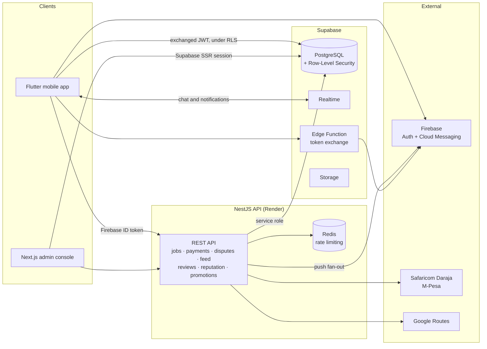
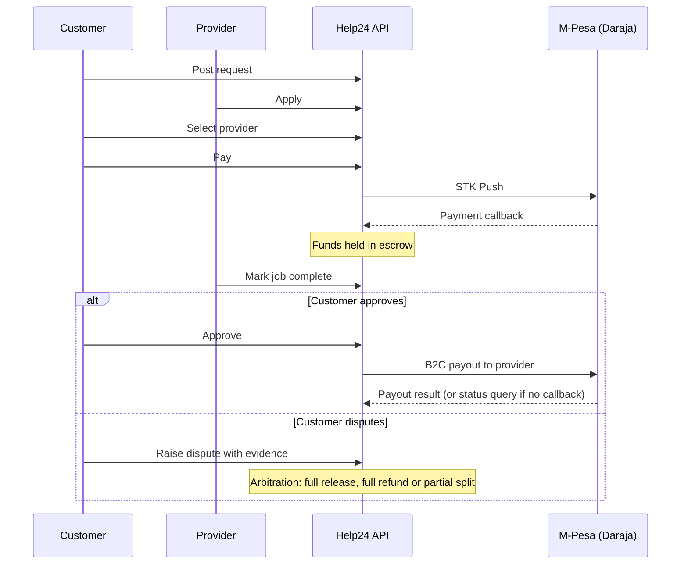

# Help24

**Get anything done — with payment held safely in M-Pesa escrow until the job is finished.**

Help24 is a Kenyan service marketplace that connects people who need work done with local service providers — fundis, cleaners, movers, tutors, technicians and more. Customers post a request, providers apply, and the customer pays through M-Pesa into escrow. The money is released to the provider only when the customer approves the completed work, or through a structured dispute process when they don't agree.

[Website](https://help24.co.ke) · [Download for Android](https://help24.co.ke/download) · [Releases](https://github.com/alphwan14/help24/releases)

> **Status:** v1.0.0 released for Android (July 2026). Launch markets: Mombasa, Nairobi and Kisumu.

---

## Contents

- [Why Help24](#why-help24)
- [Product](#product)
- [Architecture](#architecture)
- [Tech stack](#tech-stack)
- [Engineering highlights](#engineering-highlights)
- [Repository layout](#repository-layout)
- [Getting started](#getting-started)
- [Testing](#testing)
- [Deployment](#deployment)
- [Documentation](#documentation)
- [Team](#team)

---

## Why Help24

Hiring someone for everyday work in Kenya usually runs on referrals, phone calls and cash. Customers risk paying up front for work that is never finished; providers risk finishing work and never being paid. Help24 removes that risk on both sides:

- **Escrow, not trust-me.** Payment is collected by M-Pesa STK Push and held until the job is approved.
- **Verified people.** Identity checks, verified profiles, and reputation earned from completed jobs and reviews.
- **Clear prices.** Quotes are agreed before work starts, with a transparent, tiered platform fee.
- **Fair disputes.** When something goes wrong, an arbitration team reviews evidence and decides to release, refund or split the payment.

---

## Product

### Mobile app (Flutter)

- **Discover** — a ranked feed of nearby requests and offers, with search, category filters and urgency badges.
- **Post** — guided flows for requests, offers and jobs, with images, pricing and a canonical profession list.
- **Apply and hire** — providers apply with a trust summary; customers compare applicants and select one.
- **Pay** — M-Pesa STK Push straight from the job, with live payment and escrow status.
- **Messaging** — real-time chat tied to each post, with location sharing and an offline outbox.
- **Notifications** — push notifications plus an in-app notification centre.
- **Profiles and reputation** — professional profiles, reviews, reliability scores and payout-destination setup.
- **Localisation** — English and Swahili.

### Admin console (Next.js)

An internal operations console for the Help24 team, covering:

- **Overview** — revenue, growth and geography.
- **Users** — active, suspended and admin accounts.
- **Marketplace** — requests, offers, active and completed jobs.
- **Payments** — pending, completed, failed and funds held in escrow.
- **Disputes centre** — case queue, evidence, actions, refunds and resolutions.
- **Promotions** — business promotion packages and revenue.
- **Insights** — provider performance, trends, categories, demand heatmap and user behaviour.

### Website (separate repository)

The public site at [help24.co.ke](https://help24.co.ke) is built with Next.js 14 and TypeScript. It includes service and coverage pages, provider onboarding, help and legal pages, and a verified Android download page.

---

## Architecture



**How responsibilities are split:**

| Path | Owns |
|---|---|
| **NestJS API** | Everything that moves money or reputation: M-Pesa collection and payouts, escrow settlement, the job lifecycle, dispute arbitration, review eligibility, reputation, promotions and feed ranking. Firebase ID tokens are verified server-side and the user's identity is bound per route. |
| **Supabase (direct, under RLS)** | Profiles, posts, applications, chat, notifications, saved items and reference data. The app exchanges its Firebase ID token for a short-lived Supabase JWT, so Row-Level Security can scope every row to its owner. |
| **Firebase** | Sign-in (Google, phone and email) and push notification delivery. |

This split is deliberate. Direct Supabase reads and realtime channels keep the app usable while the API cold-starts, and the feed falls back to a direct query if the ranking service is unavailable.

### Job and payment lifecycle



---

## Tech stack

| Layer | Technologies |
|---|---|
| Mobile | Flutter, Dart, Provider, Supabase Flutter, Firebase (Auth, Messaging), Google Maps, Geolocator |
| Admin console | Next.js 15 (App Router, Server Actions, middleware), React 19, TypeScript, Supabase SSR, Tailwind CSS, Recharts |
| API | Node.js, NestJS 10, TypeScript, class-validator, Firebase Admin, ioredis, Axios |
| Data | PostgreSQL (Supabase), Row-Level Security, SQL functions, Supabase Realtime, Storage, Edge Functions (Deno) |
| Payments | Safaricom Daraja: STK Push, B2C, Transaction Status |
| Infrastructure | Render (API), Vercel (web), Docker Compose (local stack), GitHub Releases (Android distribution) |
| Testing | Jest, ts-jest, flutter_test |

---

## Engineering highlights

**Payments and escrow**
- STK Push collection, B2C provider payouts and Transaction Status reconciliation. A payout whose callback never arrives is resolved from Safaricom's confirmed status, never by timing out.
- A single idempotent settlement writer and a canonical settlement-state model, shared by the API and the admin console.
- Verified payout destinations and an immutable payout audit trail.

**Identity and security**
- Server-side Firebase token verification, identity binding per route, and a boot-time audit of every route's auth declaration.
- A Supabase Edge Function that verifies Firebase ID tokens (RS256 against Google's public certificates) before minting Supabase JWTs for Row-Level Security.
- Three-tier admin roles (`support_agent` → `senior_admin` → `super_admin`). Financial dispute decisions require `senior_admin`, and the last `super_admin` cannot be demoted.
- Redis-backed distributed rate limiting, using atomic Lua scripts.
- Structured logging with secret redaction.

**Real-time and notifications**
- Chat, chat lists and notifications stream over Supabase Realtime (Postgres change feeds).
- Push fan-out runs through Firebase Cloud Messaging from a single emitter, to prevent duplicate notifications.

**Discovery**
- An explainable feed-ranking engine with 15 signals, including distance, profession match, urgency, freshness, reliability, trust and recent search intent.
- Signal weights can be tuned from the database, with no app release, and are merged under compiled defaults.

**Operations**
- A remote configuration plane: kill switches, feature gates and tunables served to the app.
- Request correlation IDs, health checks, and an event processor with dead-lettering.
- Reference data (professions, Kenyan locations) served from versioned server tables, with a bundled offline fallback.
- 100+ versioned SQL migrations. Production changes are dry-run first and documented with deployment evidence.

---

## Repository layout

```
help24/
├── mobile-app/          Flutter app (Android shipped; English + Swahili)
├── admin-dashboard/     Next.js 15 admin console
├── backend/             NestJS API
│   └── src/
│       ├── mpesa/         Daraja client, STK Push, B2C, callbacks, fees
│       ├── jobs/          Job lifecycle and settlement state
│       ├── admin/         Admin auth, RBAC, disputes centre
│       ├── payouts/       Payout destinations and audit events
│       ├── feed/          Discover feed and ranking engine
│       ├── notifications/ FCM push fan-out
│       ├── reviews/       Review eligibility
│       ├── reputation/    Provider reputation
│       ├── promotions/    Business promotions
│       ├── events/        Event processing
│       ├── app-config/    Remote configuration
│       └── common/        Auth, identity, rate limiting, logging, request context
├── supabase/
│   ├── migrations/      Versioned SQL migrations
│   └── functions/       Edge Functions
├── docker/              Local Postgres and pgAdmin configuration
├── docs/                Architecture, audits, runbooks and verification reports
└── docker-compose.yml   Local API stack (Postgres and Redis are opt-in)
```

---

## Getting started

### Prerequisites

- Node.js 18+ (the Docker image uses Node 22)
- Flutter SDK (Dart 3)
- A Supabase project and a Firebase project
- Safaricom Daraja sandbox credentials
- Docker Desktop (optional, for the containerised API)

### 1. Database

Apply the SQL files in `supabase/migrations/` in order to your Supabase project, using the Supabase CLI or the SQL editor.

### 2. API

```bash
cd backend
cp .env.example .env      # fill in values; see below
npm install
npm run start:dev         # http://localhost:3000
curl http://localhost:3000/health
```

Or run it in Docker (details in [DOCKER.md](DOCKER.md)):

```bash
docker compose up -d --build
```

The API's environment variables fall into these groups (names only; see `backend/.env.example`):

| Group | Variables |
|---|---|
| Server | `NODE_ENV`, `PORT`, `CORS_ORIGINS`, `ADMIN_DASHBOARD_URL` |
| Supabase | `SUPABASE_URL`, `SUPABASE_SERVICE_ROLE_KEY` |
| Redis | `REDIS_URL`, `REDIS_REQUIRED` |
| M-Pesa | `MPESA_ENV`, `MPESA_CONSUMER_KEY`, `MPESA_CONSUMER_SECRET`, `MPESA_SHORTCODE`, `MPESA_PASSKEY`, `MPESA_CALLBACK_URL` |
| Firebase Admin | `FIREBASE_PROJECT_ID`, `FIREBASE_CLIENT_EMAIL`, `FIREBASE_PRIVATE_KEY` |
| Auth rollout | `AUTH_ENFORCEMENT`, `AUTH_ENFORCE_ONLY`, `AUTH_TOKEN_CACHE*` |
| Other | `GOOGLE_ROUTES_API_KEY`, `DEV_ROUTES_ENABLED` |

### 3. Admin console

```bash
cd admin-dashboard
cp .env.example .env.local   # NEXT_PUBLIC_SUPABASE_URL, NEXT_PUBLIC_SUPABASE_ANON_KEY,
                             # SUPABASE_SERVICE_ROLE_KEY, NEXT_PUBLIC_BACKEND_URL
npm install
npm run dev                  # http://localhost:3001
```

### 4. Mobile app

```bash
cd mobile-app
flutter pub get
flutter run                  # uses the production API by default
```

To point the app at a local API, use the build-time override defined in `lib/config/api_config.dart`.

---

## Testing

```bash
cd backend && npm test          # Jest: auth, settlement, payouts, rate limiting, ranking, disputes
cd mobile-app && flutter test   # widget and unit tests: auth, feed, messaging, payments, location
```

---

## Deployment

| Component | Target |
|---|---|
| API | Render (Docker) |
| Admin console | Vercel |
| Website | Vercel, served at [help24.co.ke](https://help24.co.ke) |
| Database, Realtime, Storage, Edge Functions | Supabase |
| Android app | Signed APK on [GitHub Releases](https://github.com/alphwan14/help24/releases), distributed through [help24.co.ke/download](https://help24.co.ke/download) with a published SHA-256 checksum |

Production migrations are additive and idempotent. Each one is dry-run against production before it is applied.

---

## Documentation

Detailed engineering documents live in [`docs/`](docs):

- **Architecture:** `backend-centric-architecture-assessment.md`, `architecture-audit-and-roadmap.md`
- **Payments:** `payout-destination-architecture.md`, `escrow-repair-production-verification.md`, `daraja-cutover-and-otp-delivery.md`
- **Launch readiness:** `launch-readiness-verification-report.md`, `production-hardening-plan.md`
- **Runbooks:** `runbooks/admin-onboarding-and-identity-linking.md`

---

## Security

Never commit secrets. Configuration belongs in `.env` files, which are git-ignored, or in your hosting provider's environment settings.

To report a vulnerability, email **support@help24.co.ke** rather than opening a public issue.

---

## Team

Help24 is built in Kenya by its co-founders:

- **Lincoln Waniala** — Co-founder, engineering · [GitHub](https://github.com/alphwan14) · [LinkedIn](https://www.linkedin.com/in/lincoln-waniala/)

---

© 2026 Help24. All rights reserved.
